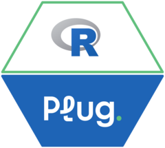

<!-- README.md is generated from README.Rmd. Please edit that file -->

# plug <a href="https://github.com/StrategicProjects/plug"></a>

<!-- badges: start -->

[](https://CRAN.R-project.org/package=plug)
[](https://CRAN.R-project.org/package=plug)
<!-- badges: end -->

The **Plug API Integration Package** provides an intuitive and secure
interface to interact with the Plug API. It enables developers to store
user credentials securely, fetch data using custom SQL queries, and
manage authentication tokens automatically.

> **Note**: To access the Plug API, you must have valid credentials
> (username and password) provided by the API administrators.

> **Note**: Plug uses Microsoft SQL as its database system, so SQL
> queries must adhere to Microsoft SQL Server syntax (e.g.,
> `SELECT TOP 1` instead of `LIMIT`).

## Installation

You can install the released version of the package from CRAN:

``` r
install.packages("plug")
```

Or the development version from GitHub:

``` r
# install.packages("remotes")
remotes::install_github("StrategicProjects/plug")
```

## Features

- **Secure Credential Storage:** Safely store and retrieve user
  credentials with keyring.
- **Token Management:** Automatically handle API token generation and
  expiration.
- **Query Execution:** Execute custom SQL queries using the Plug API,
  with values safely inserted in query templates.
- **Data Download:** Retrieve all data from specific tables with ease.

## Getting Started

Before using the package, you need to store your Plug API credentials
securely:

``` r
library(plug)

# Store your username and password
plug_store_credentials("your_username", "your_password")
```

## Fetching a Token

The package automatically fetches and caches an authentication token. If
you need to retrieve it manually, use:

``` r
# Fetch a valid token
token <- plug_get_valid_token()
```

## Listing and Removing Stored Credentials and Tokens

You can list stored credentials and tokens:

``` r
# List credentials (the password is returned in plain text)
credentials <- plug_list_credentials()

# List tokens
tokens <- plug_list_tokens()
```

And remove them from the keyring:

``` r
# Remove only the cached token
plug_clear_credentials(credentials = FALSE)

# Remove credentials and token
plug_clear_credentials()
```

## Executing SQL Queries

You can execute custom SQL queries on the Plug API:

``` r
# Example: Execute a query
data <- plug_execute_query("SELECT TOP 1 * FROM Contratos_VIEW")
```

Values can be safely inserted in the query with placeholders, using the
same syntax as `glue::glue_sql()`:

``` r
data <- plug_execute_query(
  "SELECT * FROM {`base`} WHERE Ano IN ({years*}) AND Situacao = {status}",
  base = "Contratos_VIEW",
  years = c(2023, 2024),
  status = "Ativo"
)
```

| Placeholder | Result                                                      |
|-------------|-------------------------------------------------------------|
| `{x}`       | A quoted value, such as `'Ativo'`, `2024` or `'2024-01-31'` |
| `{x*}`      | All the values of `x` separated by commas, for `IN (...)`   |
| `` {`x`} `` | A quoted identifier (table or column name), such as `[Ano]` |
| `{I(x)}`    | The value of `x` as is, without quoting                     |

## Downloading a Table

``` r
# Example: Download All Data from a Table
data <- plug_download_base(base_name = "Contratos_VIEW")
```

## Development

This package is under active development. Contributions are welcome! If
you encounter any issues, please [open an issue on
GitHub](https://github.com/StrategicProjects/plug/issues).

## License

This package is licensed under the MIT License.
